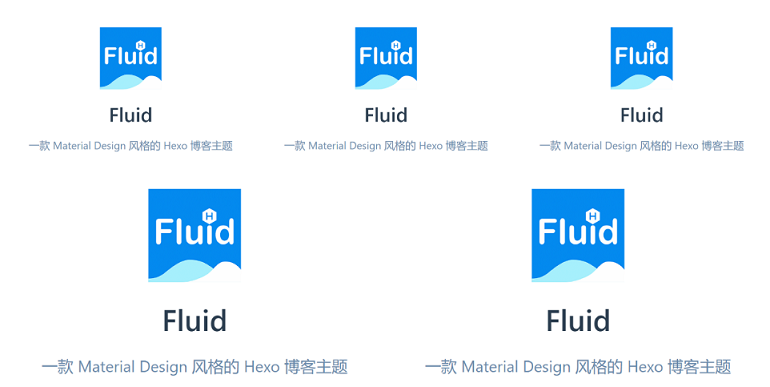

# Guide

## Theme Introduction

Fluid is an elegant Material-Design theme for Hexo, developed by [Fluid-dev](https://github.com/fluid-dev)

GitHub Repository: [https://github.com/fluid-dev/hexo-theme-fluid](https://github.com/fluid-dev/hexo-theme-fluid)

Demo blog:

[Rook1e's blog](https://rook1e.com)

[zkqiang's blog](https://zkqiang.cn)

[吃白饭的休伯利安号](https://eatrice.top)

[上屋顶看北斗七星](https://ruru.eatrice.top)

## About this Guide

This guide is only for partial configuration instructions, **Not for the all configs**, For specific configuration requirements, please refer to the comments in the file `_config.yml` at the path of the theme. For more help, Please write your questions at [issues](https://github.com/fluid-dev/hexo-theme-fluid/issues/new).

This page of the guide created by [VuePress](https://vuepress.vuejs.org/).

:::tip

About the config file:
- "**blog config**" refer to the `_config.yml` in the blog root directory.
- "**theme config**" refer to the path `theme/fluid/_config.yml`

The source directory of blog and fluid will be merged eventually, so the source of blog is preferred for the stored files

:::

## Quick Start

### Install Hexo

If you don't have a hexo blog, please follow [Hexo Docs](https://hexo.io/docs/) to install and initialize your blog。

### Download Theme

Please download [the latest release](https://github.com/fluid-dev/hexo-theme-fluid/releases), or the master branch may not guarantee stability.

After download, extract it to the themes directory and rename it to `fluid`.

### Necessary Configuration

Modify `_config.yml` in the blog root directory as follows。

```yaml
theme: fluid  # set theme
```

### Create About Page

Since v1.7.0, the about page needs to be created manually:

```bash
$ hexo new page about
```

After successful creation, modify `/source/about/index.md` and add `layout` attribute.

The modified file example is as follows:

```yaml
---
title: about
date: 2020-02-23 19:20:33
layout: about
---

# You can write the content here
Support Markdown, HTML
```

## Global

### Override Configuration

**This feature can makes upgrade the theme smoother, recommended everyone to learn to use.**

Override configuration can make the **theme config** out of the theme dictionary, and avoid losing custom config after the theme upgraded.

You should make sure that your version of *Hexo* is not lower than *3.0*, because of the function about [data-files](https://hexo.io/docs/data-files.html)

Usage:

1. cd into the folder '*source*' in your *blog root dictionary*, `mkdir _data` (beside to the folder '_post');
2. Create a file `fluid_config.yml` in the folder `_date` , copy the configurations from **theme config** to `fluid_config.yml`;
3. You can set any config with the file `fluid_config.yml`, it can be used when you start `hexo g`.

:::tip
You can also copy only part of the configurations.

The configuration existing in `fluid_config.yml` is of high priority, modifying `_config.yml` is invalid.

There may be configuration changes in the theme of upgrading, you need to manually modify `fluid_config.yml` synchronously.
:::

If you want to cancel some configurations, you should do this:

```yaml
about:
  icons:  # This is set to null, otherwise the configuration can't be override
    # - { class: 'iconfont icon-github-fill', link: 'https://github.com' }
    # - { class: 'iconfont icon-wechat-fill', qrcode: '/img/favicon.png' }
```

### Static Resource

The Url of all resource static files can be customized through `fluid/_static_prefix.yml`, it also can be override with `_data/fluid_static_prefix.yml`.

If we should get the JQuery CDN library, we can add a line at the end of the file `/source/_data/fluid_static_prefix.yml`:

``` yaml
jquery: https://cdnjs.cloudflare.com/ajax/libs/jquery/3.4.1/
```

### Local Search

- The hexo-generator-search plug-in has been integrated, please close if you have installed other search plug-ins to avoid generating redundant index files.

- By default, `local-search.xml` is generated and used in the root directory.

### Banner Image

- img src

there is `banner_img` item for every pages in the **theme config**, you can use a relative path or url.

use a local image：

```yaml
banner_img: /img/bg/example.jpg   # stored at /source/img/bg/example.jpg
```

use a url:

```yaml
banner_img: https://static.zkqiang.cn/example.jpg
```

::: tip
You can define the ain path yourself, but it should be in the folder `source`

The source directory of blog and fluid will be merged eventually, so the source of blog is preferred.
:::

- height

For different people's thoughts, you can control the height of the `banner_img` on the page.

You can set a value to `banner_img_height` for every pages in **theme config**, 0 - 100 is valuable, We think it is better to choose a number bigger than 70.

- mask alpha

You can set a value `banner_mask_alpha` for every pages in **theme config**, 0 - 1.0 is valuable, 0 is completely transparent (no mask), 1 is completely opaque

::: tip
Each post page can define its banner independently, you can read the config about the posts for more details.
:::

### Title of Blog

The title is on the left of the banner, Its value can set by the attribute `title` in file **blog config**, which is also the title of the browser's tab.

If you want to set varies titles for different pages, you can change the **theme config** as follows:

``` yaml
navbar:
  blog_title: your title
```

### Navbar

``` yaml
navbar:
  menu:
    - { key: 'home', link: '/', icon: 'iconfont icon-home-fill' }
    - { key: 'tag', link: '/tags/', icon: 'iconfont icon-tags-fill' }
    - { key: 'about', link: '/about/', icon: 'iconfont icon-user-fill', name: 'About Me' }
```

- `key`: relate to [multilingual] (/en/guide/#multi-languages). If no related , the value of the key itself will be displayed
- `link`: href link
- `icon`: css class of icon, can be omitted. [Built-in icons of theme](/en/icon/) 
- `name`: force this name to be displayed (no longer in multiple languages), can be omitted

### Lazyload Image

``` yaml
lazyload:
  enable: true
  onlypost: false
```

When enabled, the image will only be loaded when scrolling to the visible range, which can greatly improve the overall loading speed of the web page.

if `onlypost` is true, the `lazyload` will be enabled only on the post pages.

### Web Analytics

Varies analytics servers have been supported, you can fill the 'Key' and 'ID' to enable it.

```yaml
web_analytics:
  enable: true
  baidu:  # Baidu analysis's Key，refer to https://tongji.baidu.com/sc-web/10000033910/home/site/getjs?siteId=13751376 after the code 'hm.js?'
  google:  # Google analysis's Tracking ID，refer to https://analytics.google.com/analytics/web/
  tencent:  # Tencent analysis's H5 App id，refer to https://mta.qq.com/h5/manage/ctr_app_manage
  woyaola:  # 51.la analysis's ID，refer to https://www.51.la/user/site/index
  cnzz:  # cnzz analysis's web_id，refer https://web.umeng.com/main.php?c=site&a=show
```

### Multi Languages

Some languages may change the font of some theme.

You can set up you language in the **blog config**, and you should define the language file name.

``` yaml
language: zh-CN  # default is en
```

*en* *zh-CN* and *ja* is supported currently.

If you want to add more language, you'd better copy a new file to edit, and define the language file name.

### Faster Loading

1. For all the users, it is the effective way to use public CDN for the 'third-party lib', you can add it into the file `_static_prefix.yml`；

2. You can use OSS and bind your domain, then upload the files in the folder `public` to your OSS.

3. For your custom images, especially the big banner picture, you can use [tinypng](https://tinypng.com) to compress them, and upload them to your private CDN.

### Enforce Https

When your domain update to `https`, and some resources on your blog only support http protocol, the browser will not load this resources.

There will be errors in the console: `Mixed Content: The page at 'https://xxx' was loaded over HTTPS`。

If it happens, you can change the **theme config** as follow:

```yaml
force_https: true
```

Then all requests are forced by HTTPS (if it is an external resource, it needs to support HTTPS itself)

### Custom Page

If you want to generate a custom page, same as create about page.

1. Create a page from the command:

```sh
$ hexo new page example
```

2. Edit `/source/example/index.md`：

```yaml
---
title: example
subtitle: Can be omitted, default is title
---

Content (Markdown or HTML)
```

The content has no markdown style by default. If you want to have the same style as post page, you can add:

```html
<div class="markdown-body">
Content
</div>
```

3. The properties of all custom pages can be set in **theme config**:

```yaml
page:
  banner_img: /img/default.png
  banner_img_height: 70
  banner_mask_alpha: 0.3
```

Also set it in [Front-matter](https://hexo.io/zh-cn/docs/front-matter):

```yaml
---
title: example
banner_img: /img/default.png
banner_img_height: 60
banner_mask_alpha: 0.3
---

Markdown or HTML
```

### Custom JS / CSS / HTML

If you want to import external JS、CSS (such as iconfont) or HTML, you can set these in **theme config**:

```yaml
# Set the path of the custom JS file, relative to the source directory
custom_js: /js/custom.js

# Set the path of the custom CSS file, relative to the source directory
custom_css: /css/custom.css

# Customize the HTML content at the page bottom (above the footer), which can also be used to import JS or CSS externally. Be careful not to conflict with the post.custom configuration
custom_html: '<link rel="stylesheet" href="//at.alicdn.com/t/font_1067060_qzomjdt8bmp.css">'
```

## Home

### Slogan

The typewriter text in the large image of the home page can be set in the **theme config**uration file whether to turn on or not:

```yaml
index:
  slogan:
    enable: true
    text: This is a Slogan
```

If `text` is '', the `subtitle` in the 'blog config' will replace it.

Related dynamic effect settings:

```yaml
fun_features:
  typing: # 为 subtitle add Slogan effect
    enable: true
    typeSpeed: 70 # Slogan speed
    cursorChar: "_" # cursor style
    loop: false # repeat
```

### Post Excerpt

control the excerpt automatically (default is enable)：

```yaml
index:
  auto_excerpt:
    enable: true
```

If you need manual, you can use `<!-- more -->` to define excerpt.

``` markdown
This is excerpt
<!-- more -->
This is body
```

Or you can set `excerpt: This is excerpt` in [Front-matter](https://hexo.io/docs/front-matter).

Priority: Manually > Automatically.

There are 3 lines works will display in index page, the rest will be hidden automatically.

### Post Url Target

```yaml
index:
  post_url_target: _self
```

options:

1. _blank: open post page in new tab
2. _self: open post page in current tab

### Post Meta

You can hide any post meta, include: time、categories、tags etc.

After testing, if there are no thumbnails and summaries in the list of posts on the home page, the display of title + post information will make the page too crowded, so this configuration is given for students who like to display only the title of the post on the home page.

``` yaml
index:
  post_meta:
    date: true
    category: true
    tag: true
```

### Hide Post

If you want to hide some posts from the index page, you can define `hide: true` at the head of a post [Front-matter](https://hexo.io/docs/front-matter).

```yaml
---
title: post title
index_img: /img/example.jpg
date: 2019-10-10 10:00:00
hide: true
---
This is post content
```

:::tip
Hiding makes the post invisible in both category page and tag page.
You can still enter post link.
:::

## Post Page

### Index Thumbnails

You can define it at the head of a post [Front-matter](https://hexo.io/docs/front-matter).

```yaml
---
title: post title
tags: [Hexo, Fluid]
index_img: /img/example.jpg
date: 2019-10-10 10:00:00
---
This is post content
```

You can save your thumbnails in the `img` folder, or you can create a new folder in folder `source` to save them in folder `source`.

You also can using other pictures in other locations， but using the correct link.

### Post Banner Image

You can define it at the head of a post, or use the home Banner image by defaulted


```yaml
---
title: your title
tags: [Hexo, Fluid]
index_img: your Thumbnails
banner_img:  your post banner
date: 2019-10-10 10:00:00
---
This the body of the post
```

### Image In Post

You can save your pictures locally，or other locations.

```markdown

```

### Date/Word Count/Reading Time/Reading count

These information display after your post title by defaultly.

```yaml
post:
  meta:
    date:  # 日期
      enable: true
      format: "dddd, MMMM Do YYYY, h:mm a"  # format ISO-8601
    wordcount:  # word count
      enable: true
      format: "{} words"  # placeholder
    min2read:  # 阅读时间
      enable: true
      format: "{} minute"
    views:  # Reading count
      enable: true
      format: "{} times"
```

:::tip

The format of date must observe ISO-8601；

`{}`can replace number, you can change other content.

:::

### Code Highlight

Highlight style can be selected from here: <https://highlightjs.org/static/demo/> 

then set the name of style into **theme config**:

```yaml
highlight:
  enable: true
  style: 'Github Gist'
  bg_color: false
  copy_btn: true
```

`bg_color`: whether to change the code background color according to style. If style color is white, it is better to `false`
`copy_btn`: display the button to copy code

Line number of code is not supported.

### Comment

You can enable it in **theme config**:

```yaml
post:
  comments:
    enable: true
    type: disqus
```

And then fill the arguments for corresponding module, Such as:

```yaml
disqus:
  shortname: fluid
```

Valine、Disqus、Gitalk、Utterances、Changyan、livere can be supported currently.

For more comment systems, you can add corresponding ejs file into `fluid/layout/_partial/comments/`, according to your system document, and then modify `post.comments.type` link to your system.

:::tip
If you comment board don't display, after you finished below steps, there may be something wrong with you code,You can find it on the console of your browser
:::

<!-- ### daovoice -->

<!-- It is disenable defaulted, you should registration it at https://dashboard.daovoice.io , and fill your ID. -->

<!-- ```yaml -->
<!-- daovoice: -->
<!--   enable: true -->
<!--   appid: '' -->
<!-- ``` -->

### Tag Plugin

#### Note

You can use notes by inserting the HTML into markdown:

```markdown

Some content or `markdown`

```

Or：

```html
<p class="note note-primary">Note</p>
```

Optional:

<p class="note note-primary">primary</p>
<p class="note note-secondary">secondary</p>
<p class="note note-success">success</p>
<p class="note note-danger">danger</p>
<p class="note note-warning">warning</p>
<p class="note note-info">info</p>
<p class="note note-light">light</p>

#### Label

```markdown

```

Or：

```html
<span class="label label-primary">Label</span>
```

Optional：

<span class="label label-primary">primary</span>
<span class="label label-default">default</span>
<span class="label label-info">info</span>
<span class="label label-success">success</span>
<span class="label label-warning">warning</span>
<span class="label label-danger">danger</span>

#### Button

```markdown

```

Or：

```html
<a class="btn" href="url" title="title">text</a>
```

<a class="btn" href="javascript:;" title="title">text</a>

#### Group Images

```markdown

  
  
  
  
  

```

x：image total
y：lines

eg: ``



### LaTeX

Before you use [LaTeX](https://www.latex-project.org/help/documentation/) math typesetting, you should finish follow steps:

**1. **theme config****

```yaml
post:
  math:
    enable: true
    specific: false
    engine: mathjax
```

if `specific`: true，you should add `math: true` into [Front-matter](https://hexo.io/docs/front-matter) , and then the typesetting will be display on post page, and it can improve the speed of page load.

`engine`: engine for typesetting, `mathjax` or `katex` is supported.

**2. Change Markdown engine**

Because the default engine of hexo doesn't support math typesetting, it should be changed by other better engine.

Uninstall the former engine:

`npm uninstall hexo-renderer-marked --save`

Then change your engine, such as:

mathjax: `npm install hexo-renderer-kramed --save`

katex: `npm install @upupming/hexo-renderer-markdown-it-plus --save`

**3. After installing, run `hexo clean`**

:::warning

You can't install more than one engines

If your typesetting can't display correctly, you can check the below steps.

:::


:::tip

Different formula engines have different advantages and disadvantages.

**MathJax**

Advantages：

- full support for LaTeX syntax.
- right-click formula has extended function.

Shortcomings:

- need to load JS, pages will be slow to load, and there will be rendering changes.
- the kramed renderer does not support the escape character `\` of inline formulas.

**Katex**

Advantages:

- No JS will not affect page loading.
- the renderer works well (relative to kramed's inline formula for MathJax).
Shortcomings.
- A small part of LaTeX do not support it.

:::

## Archives Page

There is no attribute, but Banner.

## Categories Page

There is no attribute, but Banner.

[About adding categories](https://hexo.io/docs/front-matter)

## Tags Page

You can changes some style of tags:

``` yaml
tag:
  tagcloud:
    min_font: 15
    max_font: 30
    unit: px  # font-size
    start_color: "#BBBBEE"
    end_color: "#337ab7"
```

[About adding tags](https://hexo.io/docs/front-matter)

## About Page

### Create About Page

Since v1.7.0, the about page needs to be created manually:

```bash
$ hexo new page about
```

After successful creation, modify `/source/about/index.md` and add `layout` attribute.

The modified file example is as follows:

```yaml
---
title: about
date: 2020-02-23 19:20:33
layout: about
---

# You can write the content here
Support Markdown, HTML
```

### Icons

[Built-in icons of theme](/en/icon/) 

## 404 Page

If guest try to get the pages, which are not existed, 404 page will display.

To open this page, you need to configure it on the deployment environment of the blog:

- If your blog is deployed on a cloud server, you need to set the Nginx profile `error_page 404 = ./404.html`;
- If deployed on Github Pages, no additional configuration is required, but the custom domain must be bound.
- For other platforms such as OSS, please refer to the 404-page configuration documentation for each platform, but not all platforms support redirect to this Html.

## About Hexo Configuration

[Blog _config.yml](https://hexo.io/docs/configuration)

[Post Front-matter](https://hexo.io/docs/front-matter)

## MIT

[MIT](https://github.com/fluid-dev/hexo-theme-fluid/blob/master/LICENSE)
