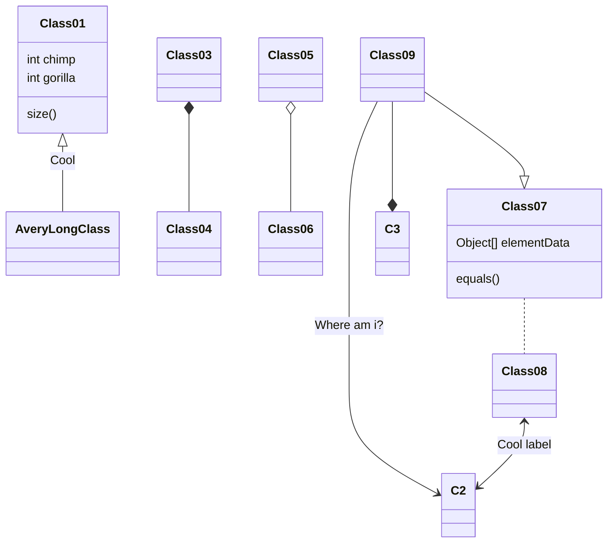

# Guide

<Adsense :data-ad-client=$themeConfig.ads.client :data-ad-slot=$themeConfig.ads.slot is-new-ads-code="yes" class="side-ads"></Adsense>

## About this Guide

This guide is only for partial configuration instructions, **Not for the all configs**, For specific configuration requirements, please refer to the comments in the file `_config.yml` at the path of the theme. For more help, Please write your questions at [issues](https://github.com/fluid-dev/hexo-theme-fluid/issues/new).

:::tip
About the config file in the guide:
- "**blog config**" refer to the `_config.yml` in the blog root directory.
- "**theme config**" refer to the path `theme/fluid/_config.yml`
:::

## Global

### Override Configuration

:::tip
Override configuration can avoid losing your customized configuration when updating Fluid.

Users who install Fluid via Npm can ignore it, other users are recommended to learn to use it.
:::

If your Hexo version >= 5.0.0, create `_config.fluid.yml` in the blog directory and copy the content of [_config.yml](https://github.com/fluid-dev/hexo-theme-fluid/blob/master/_config.yml)

Notice:
- The configuration existing in `_config.fluid.yml` is of high priority, modifying `_config.yml` is useless.
- There may be configuration changes in the theme of upgrading, you need to manually modify `_config.fluid.yml` synchronously.
- You can use `hexo g -- debug` to check override configuration.
- If you want to cancel some configurations, you should do this:

```yaml
about:
  icons:  # This is set to null, otherwise the configuration can't be override
    # - { class: 'iconfont icon-github-fill', link: 'https://github.com' }
    # - { class: 'iconfont icon-wechat-fill', qrcode: '/img/favicon.png' }
```

<details>
  <summary>Hexo version < 5.0.0 click here</summary>

You should make sure that your version of *Hexo* is not lower than *3.0*, because of the function about [data-files](https://hexo.io/docs/data-files.html)

Usage:

1. Go to or create `source/_data` directory of the blog directory;
2. Create a file `fluid_config.yml` in `_date` , copy the content of [_config.yml](https://github.com/fluid-dev/hexo-theme-fluid/blob/master/_config.yml) to `fluid_config.yml`;
3. You can set any config with the file `fluid_config.yml`, it can be used when `hexo g`.

</details>

### Static Assets

The Url of all static files can be customized through the `static_prefix` item in **theme config**.

For example, custom the JQuery CDN library, you can set:

```yaml
static_prefix:
  # ...
  jquery: https://cdnjs.cloudflare.com/ajax/libs/jquery/3.4.1/
```

### Local Search

- The hexo-generator-search plug-in has been integrated, please close if you have installed other search plug-ins to avoid generating redundant index files.

- By default, `local-search.xml` is generated and used in the root directory.

### Banner Image

- img src

there is `banner_img` item for every pages in the **theme config**, you can use a relative path or url.

use a local image：

```yaml
banner_img: /img/bg/example.jpg   # stored at /source/img/bg/example.jpg
```

use a url:

```yaml
banner_img: https://static.zkqiang.cn/example.jpg
```

::: tip
You can define the ain path yourself, but it should be in the `source` directory

The source directory of blog and fluid will be merged eventually, so the source of blog is preferred.
:::

- height

For different people's thoughts, you can control the height of the `banner_img` on the page.

You can set a value to `banner_img_height` for every pages in **theme config**, 0 - 100 is valuable, We think it is better to choose a number bigger than 70.

- alpha of mask

You can set a value `banner_mask_alpha` for every pages in **theme config**, 0 - 1.0 is valuable, 0 is completely transparent (no mask), 1 is completely opaque

::: tip
Each post page can define its banner independently, you can read the config about the posts for more details.
:::

<InArticleAdsense :data-ad-client=$themeConfig.ads.client :data-ad-slot=$themeConfig.ads.inSlot is-new-ads-code="yes"></InArticleAdsense>

### Title of Blog

The title is on the left of the banner, Its value can set by the attribute `title` in file **blog config**, which is also the title of the browser's tab.

If you want to set varies titles for different pages, you can change the **theme config** as follows:

```yaml
navbar:
  blog_title: your title
```

### Navbar

```yaml
navbar:
  menu:
    - { key: 'home', link: '/', icon: 'iconfont icon-home-fill' }
    - { key: 'tag', link: '/tags/', icon: 'iconfont icon-tags-fill' }
    - { key: 'about', link: '/about/', icon: 'iconfont icon-user-fill', name: 'About Me' }
```

- `key`: relate to [multilingual] (/en/guide/#languages). If no related , the value of the key itself will be displayed
- `link`: href link
- `icon`: css class of icon, can be omitted. [Built-in icons of theme](/en/icon/) 
- `name`: force this name to be displayed (no longer in multiple languages), can be omitted

Navbar supports subordinate menu:

```yaml
menu:
  - {
      key: 'Docs',
      icon: 'iconfont icon-books',
      submenu: [
        { key: 'Guide', link: 'https://hexo.fluid-dev.com/docs/en/guide/' },
        { key: 'Advance', link: 'https://hexo.fluid-dev.com/docs/en/advance/' },
        { key: 'Icon', link: 'https://hexo.fluid-dev.com/docs/en/icon/' }
      ]
  }
```

<InArticleAdsense :data-ad-client=$themeConfig.ads.client :data-ad-slot=$themeConfig.ads.inSlot is-new-ads-code="yes"></InArticleAdsense>

### Lazyload

Lazyload will make the image or comment plugin load only when it scrolls to visible, which can greatly improve the speed of loading your blog.

It is enabled by default, you can set some items in **theme config**:

```yaml
lazyload:
  enable: true
  loading_img: /img/loading.gif
  onlypost: false
  offset_factor: 2
```

`loading_img`: The placeholder image when loading

`onlypost`: If true, only enable lazyload on the post page. For custom pages, you can set `lazyload: true` in [Front-matter](https://hexo.io/zh-cn/docs/front-matter)

`offset_factor`: The factor of viewport height that triggers loading

### Font

The font-size and font-family of all page can be set through this items in **theme config**:

```yaml
font:
  font_size: 16px
  font_family:
  code_font_size: 85%
```

If you want to set a specific page, you can write the style tag in markdown:

```html
---
title: example
---

<style>
  /* For the page */
  html, body, .markdown-body {
    font-family: KaiTi,"Microsoft YaHei",Georgia, sans, serif;
    font-size: 15px;
  }

  /* For the markdown content only */
  .markdown-body {
    font-family: KaiTi,"Microsoft YaHei",Georgia, sans, serif;
    font-size: 15px;
  }
</style>
```

### Web Analytics

Varies analytics servers have been supported, you can fill the 'Key' and 'ID' to enable it.

```yaml
web_analytics:
  enable: true
  baidu:  # Baidu analysis's Key，refer to https://tongji.baidu.com/sc-web/10000033910/home/site/getjs?siteId=13751376 after the code 'hm.js?'
  google:  # Google analysis's Tracking ID，refer to https://analytics.google.com/analytics/web/
  tencent:  # Tencent analysis's H5 App id，refer to https://mta.qq.com/h5/manage/ctr_app_manage
  woyaola:  # 51.la analysis's ID，refer to https://www.51.la/user/site/index
  cnzz:  # cnzz analysis's web_id，refer https://web.umeng.com/main.php?c=site&a=show
```

<InArticleAdsense :data-ad-client=$themeConfig.ads.client :data-ad-slot=$themeConfig.ads.inSlot is-new-ads-code="yes"></InArticleAdsense>

### Languages

Set a different language in the **blog config** will change the text of the theme:

```yaml
language: en
```

You can check which languages are supported in the theme [languages](https://github.com/fluid-dev/hexo-theme-fluid/tree/master/languages) directory, as long as the value of the above configuration is the same as the file name.

You can also use a similar way to override the configuration to customize the language:

1. Go to or create `source/_data` directory of the blog directory, then create the `languages` folder;
2. Create a file named `en.yml` in `source/_data/languages` , copy the content of [en.yml](https://github.com/fluid-dev/hexo-theme-fluid/blob/master/languages/en.yml) in `fluid/languages` to you just created;
3. You can reset any config in `en.yml` you just created, it can be used when `hexo g`.

Of course, you can also choose other language yaml, just keep the filename and config value the same.

### Enforce Https

When your domain update to `https`, and some resources on your blog only support http protocol, the browser will not load this resources.

There will be errors in the console: `Mixed Content: The page at 'https://xxx' was loaded over HTTPS`。

If it happens, you can change the **theme config** as follow:

```yaml
force_https: true
```

Then all requests are forced by HTTPS (if it is an external resource, it needs to support HTTPS itself)

### Custom JS / CSS / HTML

If you want to import external JS、CSS (such as iconfont) or HTML, you can set these in **theme config**:

```yaml
# Set the path of the custom JS file, relative to the source directory
custom_js: /js/custom.js

# Set the path of the custom CSS file, relative to the source directory
custom_css: /css/custom.css

# Customize <head> HTML content
custom_head: '<meta name="key" content="value">'

# Customize the HTML content at the page bottom (above the footer), which can also be used to import JS or CSS externally. Be careful not to conflict with the post.custom configuration
custom_html: '<link rel="stylesheet" href="//at.alicdn.com/t/font_1067060_qzomjdt8bmp.css">'
```

### Dark Mode

Theme dark mode, switch button will appear in the menu after enable.

```yaml
dark_mode:
  enable: true
  default: auto
```

`default` Is the default mode of dark color, optional parameters：auto / light / dark

When you select `auto`, the color schema of viewers will follow [prefers-color-scheme](https://developer.mozilla.org/en/docs/Web/CSS/@media/prefers-color-scheme)

If this is not supported, enter dark mode from 18:00 local time to 6:00 the next day.

Regardless of any mode is selected, when the viewer manually switches, the options will be saved in local-storage, and the viewer will no follow the default mode.

### OpenGraph

[OpenGraph](https://ogp.me/) enables any web page to become a rich object in a social graph. For instance, this is used on Facebook to allow any web page to have the same functionality as any other object on Facebook.

Fluid implements this feature based on [Hexo built-in method](https://hexo.io/docs/helpers.html#open-graph) and is enabled by default, but if you want to use it better on social such as Facebook, you need to complete the following config items in **theme config**:

```yaml
open_graph:
  enable: true
  twitter_card: summary_large_image
  twitter_id:
  twitter_site:
  google_plus:
  fb_admins:
  fb_app_id:
```

In addition, you can set fields in [Front-matter](https://hexo.io/docs/front-matter) to specify the OpenGraph property of a single page:

```yaml
---
og_img: /img/og.png
---
```

## Home

### Slogan

The typing text in the banner image of the home page can be set in the **theme config**:

```yaml
index:
  slogan:
    enable: true
    text: This is a Slogan
    api:
      enable: false
      url: "https://v1.hitokoto.cn/"
      method: "GET"
      headers: {}
      keys: ["hitokoto"]
```

If `text` is blank, the `subtitle` in the **blog config** will replace it.

In addition, the content can be obtained through the API interface. If the request fails, it will be displayed in the text field:

`url`: API url, which must be returned in JSON format

`method`: request method, optional `GET`, `POST`, `PUT`

`headers`: request headers, if the url requires some header items, set it here

`keys`: Get the value field of the string from the response result, the program will get the value according to the field in the list, and finally need to get a string

For example, the content returned by the url is:

```json
[
    {
        "data": {
            "author": "Fluid",
            "content": "An elegant theme"
        }
    },
    {
        "data": {
            "author": "Test",
            "content": "Test content"
        }
    }
]
```

Set `keys: ["data", "content"]`, the program will execute as follows:

1. If the response is a list, the program will get the first item (if not a list, skip this step)
2. Get the value through the first key `data`, find that it is not a string, continue execution
3. Get the value through the second key `content`, find it is a string, and return the content; if it is not a string, the retrieval fails and the text value is used

The subtitle is enabled by default typing mobility, and the related configs is as follows:

```yaml
fun_features:
  typing:
    enable: true
    typeSpeed: 70
    cursorChar: "_"
    loop: false
```

:::tip
Use the API feature of slogan must be first enable the typing feature
:::

### Post Excerpt

Control the excerpt automatically (default is enable)：

```yaml
index:
  auto_excerpt:
    enable: true
```

If you need manual, you can use `<!-- more -->` to define except.

```markdown
Part of the content as an excerpt
<!-- more -->
The rest of the text
```

Or you can set `excerpt` in [Front-matter](https://hexo.io/docs/front-matter):

```yaml
---
title: This is a title
excerpt: Some words
---
```

:::tip
Priority: Manually > Automatically.

There are 3 lines works will display in index page, the rest will be hidden automatically.
:::

<InArticleAdsense :data-ad-client=$themeConfig.ads.client :data-ad-slot=$themeConfig.ads.inSlot is-new-ads-code="yes"></InArticleAdsense>

### Post Url Target

```yaml
index:
  post_url_target: _self
```

options:

1. _blank: open post page in new tab
2. _self: open post page in current tab

### Post Meta

You can hide any post meta, include: time、categories、tags etc.

After testing, if there are no thumbnails and summaries in the list of posts on the home page, the display of title + post information will make the page too crowded, so this configuration is given for students who like to display only the title of the post on the home page.

```yaml
index:
  post_meta:
    date: true
    category: true
    tag: true
```

### Hide Posts

If you want to hide some posts on the index page, you can set `hide: true` at the [Front-matter](https://hexo.io/docs/front-matter) of the post.

```yaml
---
title: post title
index_img: /img/example.jpg
date: 2019-10-10 10:00:00
hide: true
---
This is post content
```

:::tip
Hiding makes the post invisible in both category page and tag page.
You can still enter post link.
:::

### Sort Posts

If you want to sort posts on the index page, you can set `sticky` at the [Front-matter](https://hexo.io/docs/front-matter) of the post, the premise is `hexo-generator-index` >= 2.0.0.

```yaml
---
title: post title
index_img: /img/example.jpg
date: 2019-10-10 10:00:00
sticky: 100
---
This is post content
```

The higher value of `sticky`, the more forward the post will be.

When the post is setting with `sticky`, Fluid will add an icon before the post title on the index page by default. You can modify something in **theme config**:

```yaml
index:
  post_sticky:
    enable: true
    icon: 'iconfont icon-top'
```

`icon` can be modified to other icons through [custom icon](/en/icon/)

## Post Page

### Index Image

You can define it at [Front-matter](https://hexo.io/docs/front-matter) of a post.

```yaml
---
title: post title
tags: [Hexo, Fluid]
index_img: /img/example.jpg
date: 2019-10-10 10:00:00
---
This is post content
```

You can save the index image in the `img` folder, or create a new directory in `source` directory to save them.

You also can using other images in other locations, but using the correct link.

If you want to set a default image for all posts (when any post does not set the `index_img` will use this image by default), which can be set in **theme config**:

```yaml
post:
  default_index_img: /img/example.jpg
```

When `default_index_img` and `index_img` are empty, no image will be displayed on the home page of the post.

### Banner Image

The default display of `post.banner_img` in **theme config**, you can set `banner_img` via [Front-matter](https://hexo.io/zh-cn/docs/front-matter) to set it separately:

```yaml
---
title: your title
tags: [Hexo, Fluid]
index_img: /img/example.jpg
banner_img: /img/banner.jpg
date: 2019-10-10 10:00:00
---
This the content of the post
```

### Image In Post

You can save your pictures locally，or other locations.

```markdown

```

### Post Meta

This meta display after the post title.

```yaml
post:
  meta:
    author:  # post author, first according to `author` in front-matter, then according to `author` in Hexo config
      enable: false
    date:  # post date, first according to `date` in front-matter, then according to date of md file
      enable: true
      format: "dddd, MMMM Do YYYY, h:mm a"  # format ISO-8601
    wordcount:  # word count
      enable: true
      format: "{} words"  # placeholder
    min2read:  # Time required to read
      enable: true
      format: "{} minute"
    views:  # views count
      enable: false
      source: "leancloud"
      format: "{} times"
```

:::tip

The format of date must observe ISO-8601；

`{}`can replace number, you can change other content.

:::

### Code Block

```yaml
code:
  copy_btn: true
  highlight:
    enable: true
    line_number: true
    lib: "highlightjs"
    highlightjs:
      style: 'Github Gist'
      bg_color: false
    prismjs:
      style: "default"
      preprocess: true
```

`copy_btn`: If true, enable copy code button

`line_number`: If true, the code block display line numbers

`highlight`: Configs of highlight library

`lib`: Select the library to generate the highlight, options: highlightjs, prismjs, see the comments of the highlight configs in **theme config**

<InArticleAdsense :data-ad-client=$themeConfig.ads.client :data-ad-slot=$themeConfig.ads.inSlot is-new-ads-code="yes"></InArticleAdsense>

### Comment

You can enable it in **theme config**:

```yaml
post:
  comments:
    enable: true
    type: disqus
```

And then fill the arguments for corresponding module, Such as:

```yaml
disqus:
  shortname: fluid
```

List of supported comment plugins：
- [Valine](https://valine.js.org/configuration.html) : based on LeanCloud
- [Waline](https://waline.js.org/) : derived from Valine with self-hosted service
- [Gitalk](https://github.com/gitalk/gitalk) : based on GitHub Issues
- [Utterances](https://utteranc.es) : based on GitHub Issues
- [Disqus](https://disqus.com) : based on third-party service
- [Changyan](http://changyan.kuaizhan.com) : based on third-party service
- [Livere](https://www.livere.com) : based on third-party service
- [Remark42](https://remark42.com) : based on self-hosted service
- [Twikoo](https://twikoo.js.org) : based on Tencent CloudBase
- [Cusdis](https://cusdis.com) : based on third-party or self-hosted service

For usage and parameter setting, please click the link above to view the respective documents.

If you want to import a new comment plugin, you can add `<script>` through [Custom JS](/en/guide/#custom-js-css-html), and judge whether there is `#comments` element to mount.

:::tip
If your comment area is not displayed, there may be throwing some errors, you can find out the reason in the console of your browser.
:::

If you want to disable comment plugin on a post page, or want to enable comments on a custom page, you can set `comment: false` or `comment: 'type'` into [Front-matter](https://hexo.io/zh-cn/docs/front-matter).

For example, enable comment plugin on the about page:

```yaml
---
title: About Page
layout: about
index_img: /img/example.jpg
date: 2019-10-10 10:00:00
comment: 'disqus'
---
Some words...
```

### Footnote

Fluid has built-in footnote, which can automatically generate footnotes with anchor points at the end of the post.

This is enabled by default in **theme config**:

```yaml
post:
  footnote:
    enable: true
```

Syntax：

```markdown
There are some words[^1]
[^1]: This is the footnote
```

A better way to use it is to put a footnote at the end of the post:

```markdown
Content

## Reference
[^1]: Text-A
[^2]: Text-B
```

You can also add section headers automatically by modifying `header`:

```yaml
post:
  footnote:
    enable: true
    header: '<h2>Reference</h2>'  # It's equivalent to writing `## Reference`
```

### Tag Plugin

#### Note

You can use notes by inserting the snippet into markdown:

```markdown

Some content or `markdown`

```

Or：

```html
<p class="note note-primary">Note</p>
```

Optional:

<p class="note note-primary">primary</p>
<p class="note note-secondary">secondary</p>
<p class="note note-success">success</p>
<p class="note note-danger">danger</p>
<p class="note note-warning">warning</p>
<p class="note note-info">info</p>
<p class="note note-light">light</p>

#### Label

You can use labels by inserting the snippet into markdown:

```markdown

```

Or：

```html
<span class="label label-primary">Label</span>
```

Optional：

<span class="label label-primary">primary</span>
<span class="label label-default">default</span>
<span class="label label-info">info</span>
<span class="label label-success">success</span>
<span class="label label-warning">warning</span>
<span class="label label-danger">danger</span>

#### CheckBox

You can use the following format in markdown:

```markdown

```

text: text of item  
checked：this item is checked or not, default false
incline: inline or not, default false

eg：
<div>
  <input type="checkbox" disabled checked>
</div>
<div>
  <input type="checkbox" disabled checked>
</div>
<input type="checkbox" disabled> no wrapping after text
<div>
  <input type="checkbox" disabled> You can also write some text after the checkbox
</div>

#### Button

```markdown

```

Or：

```html
<a class="btn" href="url" title="title">text</a>
```

<a class="btn" href="javascript:;" title="title">text</a>

#### Group Images

If you want to display a group of multiple images, you can use the following format in markdown:

```markdown

  
  
  
  
  

```

total：total number of images  
n1-n2-... ：number of images in each row

eg: `` means 5 images in total, 3 in the first row and 2 in the second row.


### Math

:::tip
For hexo 5.0+, you can try [hexo-math](https://github.com/hexojs/hexo-math) plugin to support more customization.
:::

If you want to use [LaTeX](https://www.latex-project.org/help/documentation/) math, you should finish follow steps:

**1. **theme config****

```yaml
post:
  math:
    enable: true
    specific: false
    engine: mathjax
```

if `specific`: true，you should add `math: true` into [Front-matter](https://hexo.io/docs/front-matter) , and then the typesetting will be display on post page, and it can improve the speed of page load.

`engine`: engine for typesetting, `mathjax` or `katex` is supported.

**2. Change Markdown engine**

Because the default engine of hexo doesn't support math typesetting, it should be changed by other better engine.

Uninstall the former engine:

`npm uninstall hexo-renderer-marked --save`

Then change your engine, such as:

mathjax: `npm install hexo-renderer-pandoc --save` **also need to [install Pandoc](https://github.com/jgm/pandoc/blob/master/INSTALL.md)**

katex: `npm install @upupming/hexo-renderer-markdown-it-plus --save`

**3. After installing, run `hexo clean`**

Write LaTeX in Markdown:

```markdown
$$
E=mc^2
$$
```

:::warning

You can't install more than one renderer, and can't install plugins such as `hexo-math` or `hexo-katex`.

If your typesetting can't display correctly, you can check the below steps.

The custom page doesn't load math by default, you need to specify `math: true`  into [Front-matter](https://hexo.io/docs/front-matter) to ues it.

:::


:::tip

Different formula engines have different advantages and disadvantages.

**MathJax**

Advantages：

- full support for LaTeX syntax.
- right-click formula has extended function.

Shortcomings:

- need to load JS, pages will be slow to load, and there will be rendering changes.
- the kramed renderer does not support the escape character `\` of inline formulas.

**Katex**

Advantages:

- No JS will not affect page loading.
- the renderer works well (relative to kramed's inline formula for MathJax).
Shortcomings.
- A small part of LaTeX do not support it.

:::

<InArticleAdsense :data-ad-client=$themeConfig.ads.client :data-ad-slot=$themeConfig.ads.inSlot is-new-ads-code="yes"></InArticleAdsense>

### Mermaid

If you want to use [Mermaid](http://mermaid-js.github.io/mermaid/#/), you should enable it:

```yaml
post:
  mermaid:
    enable: true
    specific: false
    options:
```

`specific`: If true, only set `mermaid: true` into Front-matter will enable mermaid, to load faster when the page does not contain mermaid

`options`: API options, see [mermaidAPI.js](http://mermaid-js.github.io/mermaid/#/mermaidAPI)

Write mermaid in Markdown, you can use the mermaid tag:

```markdown

gantt
dateFormat  YYYY-MM-DD
title Adding GANTT diagram to mermaid

section A section
Completed task        :done,    des1, 2014-01-06,2014-01-08
Active task           :active,  des2, 2014-01-09, 3d
Future task           :         des3, after des2, 5d
Future task2          :         des4, after des3, 5d

```

Alternatively, it can be written in code block:

```markdown


## Archive Page

Please refer to **theme config** comments for details.

## Category Page

Please refer to **theme config** comments for details.

[About adding categories](https://hexo.io/docs/front-matter)

## Tag Page

You can custom some style of tags:

```yaml
tag:
  tagcloud:
    min_font: 15
    max_font: 30
    unit: px  # font-size
    start_color: "#BBBBEE"
    end_color: "#337ab7"
```

[About adding tags](https://hexo.io/docs/front-matter)

## About Page

### Create About Page

Since v1.7.0, the about page needs to be created manually:

```bash
$ hexo new page about
```

After successful creation, modify `/source/about/index.md` and add `layout` attribute.

The modified file example is as follows:

```yaml
---
title: 标题
layout: about
---

You can write the content here, support Markdown, HTML
```

### Meta

You can set some meta information about yourself in **theme config**:

```yaml
about:
  avatar: /img/avatar.png
  name: "Fluid"
  intro: "An elegant theme for Hexo"
```

### Icons

Set icons in **theme config**:

```yaml
about:
  icons:
    - { class: 'iconfont icon-github-fill', link: 'https://github.com', tip: 'GitHub' }
    - { class: 'iconfont icon-youtube-fill', link: 'https://youtube.com', tip: 'YouTube' }
    - { class: 'iconfont icon-twitter-fill', qrcode: '/img/favicon.png' }
```

- `class`: CSS class of icons, [more built-in icons of theme](/en/icon/)
- `link`: target link
- `tip`: display the tip when the mouse hovers over the icon
- `qrcode`: QR-code image, when using this field, clicking will not be directed, but hover QR-code

<InArticleAdsense :data-ad-client=$themeConfig.ads.client :data-ad-slot=$themeConfig.ads.inSlot is-new-ads-code="yes"></InArticleAdsense>

### Comment

Enable comment plugin via the [Front-matter](https://hexo.io/zh-cn/docs/front-matter) set `comment: bool` to enable the comment plugin, or set `comment: 'type'`to enable the specified comment plugin.

```yaml
---
title: This is a title
layout: about
comment: 'disqus'
---
```

### Link Page

The link page is used to display the site of friends. It is closed by default. To enable it, you need to delete the comment (#) of `links` in the `navbar` config item:

```yaml
navbar:
  menu:
    - { key: 'links', link: '/links/', icon: 'iconfont icon-link-fill' }
```

Then find the config item of `links` and set:

```yaml
links:
  items:
    - {
      title: 'Fluid Docs',
      intro: 'Theme usage guide',
      link: 'https://hexo.fluid-dev.com/docs/',
      avatar: '/img/favicon.png'
    }
  default_avatar: /img/avatar.png
```

- `title`: The title of the site
- `intro`: The introduction of the site
- `link`: The link of the site
- `avatar`: The avatar image of the site, can be omitted
- `default_avatar`: The default avatar of the site (replace only when the avatar is specified and fails to load)

<InArticleAdsense :data-ad-client=$themeConfig.ads.client :data-ad-slot=$themeConfig.ads.inSlot is-new-ads-code="yes"></InArticleAdsense>

## Custom Page

### Create page

If you want to create a custom page, same as create about page.

1. Create a page from the command:

```sh
$ hexo new page example
```

2. Edit `/source/example/index.md`：

```yaml
---
title: example
subtitle: Can be omitted, default is title
---

Content (Markdown or HTML)
```

The content has no markdown style by default. If you want to have the same style as post page, you can add:

```html
<div class="markdown-body">
Content
</div>
```

### Configuration

The params of all custom pages can be set in **theme config**:

```yaml
page:
  banner_img: /img/default.png
  banner_img_height: 70
  banner_mask_alpha: 0.3
```

Also set it in [Front-matter](https://hexo.io/zh-cn/docs/front-matter):

```yaml
---
title: example
banner_img: /img/default.png
banner_img_height: 60
banner_mask_alpha: 0.3
---

Markdown or HTML
```

### Comment

Enable comment plugin in the same way as the about page, via the [Front-matter](https://hexo.io/zh-cn/docs/front-matter), set `comment: bool` to enable the comment plugin, or set `comment: 'type'`to enable the specified comment plugin.

```yaml
---
title: example
comment: 'disqus'
---
```

## 404 Page

If guest try to get the pages, which are not existed, 404 page will display.

To open this page, you need to configure it on the deployment environment of the blog:

- If your blog is deployed on a cloud server, you need to set the Nginx profile `error_page 404 = ./404.html`;
- If deployed on GitHub Pages, no additional configuration is required, but the custom domain must be bound.
- For other platforms such as OSS, please refer to the 404-page configuration documentation for each platform, but not all platforms support redirect to 404 page.

Fluid contains the default 404 page, you can also place the custom `404.html` in `source` directory
