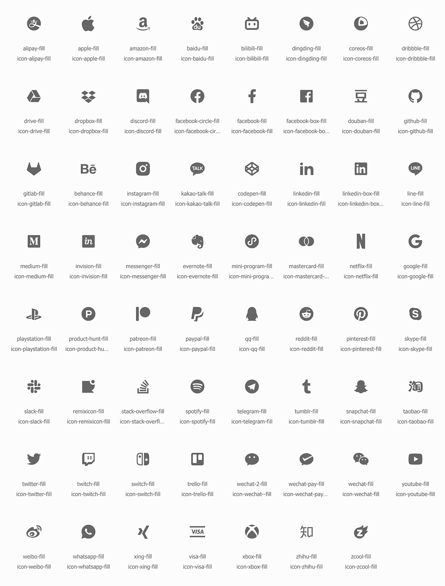

# Icons

<Adsense :data-ad-client=$themeConfig.ads.client :data-ad-slot=$themeConfig.ads.slot is-new-ads-code="yes" class="side-ads"></Adsense>

## Build-in Icons

There are some built-in social icons in the theme, all from [iconcont](https://www.iconcont.cn/):

Just fill the beginning with 'icon-' into CSS class, eg: `iconfont icon-twitter-fill`.

The icons are mainly used in related pages, of course, you can also use any place by HTML. 

<InArticleAdsense :data-ad-client=$themeConfig.ads.client :data-ad-slot=$themeConfig.ads.inSlot is-new-ads-code="yes"></InArticleAdsense>

## Custom Icons

If you want to use other icons, you can set `iconfont` of **theme config** to include your own Iconfont or Font-Awesome, and then insert them to css class.
