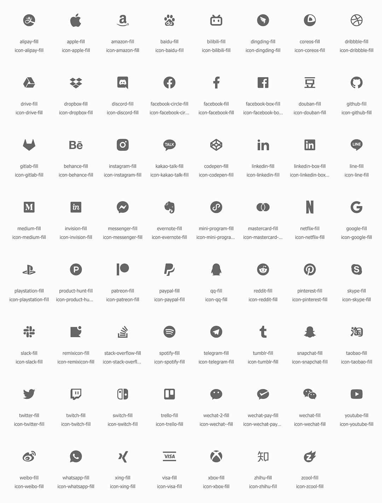

# Icons

## Build-in Icons

There are some built-in social icons in the theme, all from [Iconfont](https://www.iconfont.cn/):

Just fill the beginning with 'icon-' into CSS class, eg: `iconfont icon-twitter-fill`.

The icons are mainly used in related pages, of course, you can also use them in any place by HTML.

## Custom Icons

If you want to use other icons, you can set `iconfont` of **theme config** to include your own Iconfont or Font-Awesome, and then insert them to css class.
