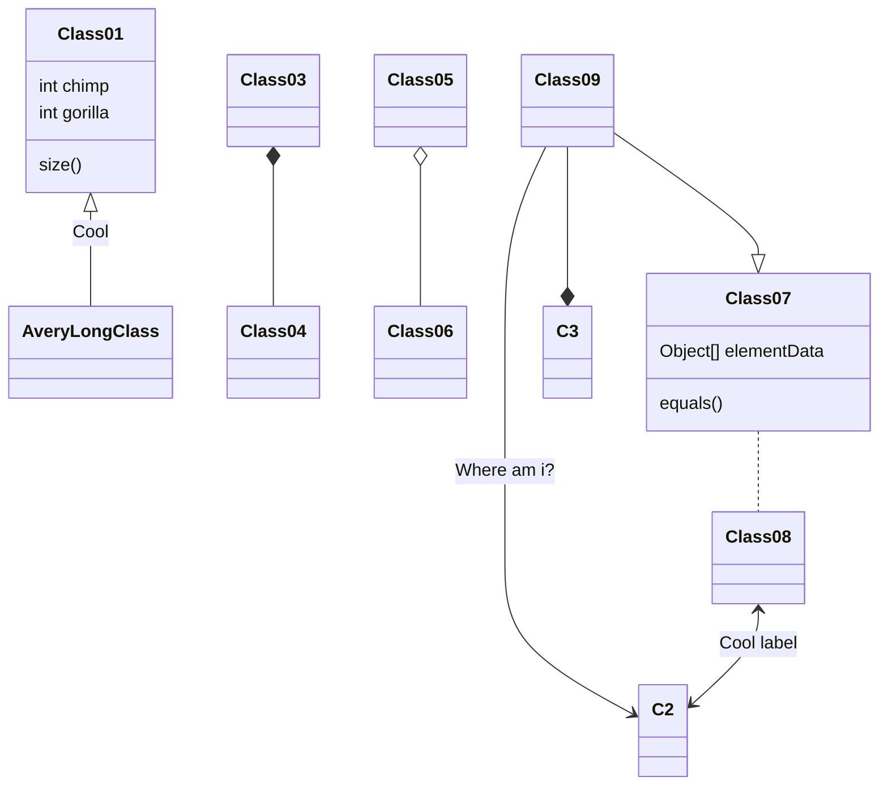

# 配置指南

<Adsense :data-ad-client=$themeConfig.ads.client :data-ad-slot=$themeConfig.ads.slot is-new-ads-code="yes" class="side-ads"></Adsense>

## 关于指南

:::tip
致主题的新用户：

- 本指南经过数个版本打磨，绝大部分的功能都有详细说明，请仔细阅读，节约自己和他人的时间；

- 本指南中提到的："**博客配置**" 指的 Hexo 博客目录下的 `_config.yml`，"**主题配置**" 指的是 `theme/fluid/_config.yml` 或者 `_config.fluid.yml` ，注意区分；

- 本指南中提到的 `source` 目录都指的是博客目录下的 `source` 文件夹，不推荐修改主题内 `source` 目录；

- 每次无论 `hexo g` 或 `hexo s`，都最好先使用 `hexo clean` 清除本地缓存；

- 页面结果以本地 `hexo s` 为准，部署后的异常大部分是线上缓存原因，在确认没有报错的情况下，等待若干时间后即可正常；

- 由于主题的不同版本会存在配置差异，本指南以最新版本为准。
:::

本指南不包括所有的配置说明，几乎每个配置在**主题配置**中都有注释，可配合指南共同参考使用。

另外本指南仅包含主题范围内的使用说明，如果是 Hexo 的使用或者 Hexo 插件的使用，请查阅各自的文档。

若存在其他主题相关的疑问请在 [issues](https://github.com/fluid-dev/hexo-theme-fluid/issues/new) 留言。

## 全局

### 覆盖配置

:::tip
覆盖配置可以使**主题配置**放置在 fluid 目录之外，避免在更新主题时丢失自定义的配置。

通过 Npm 安装主题的用户可忽略，其他用户建议学习使用。
:::

Hexo 5.0.0 版本以上的用户，在博客目录下创建 `_config.fluid.yml` 文件，将主题的 [_config.yml](https://github.com/fluid-dev/hexo-theme-fluid/blob/master/_config.yml) 全部配置（或部分配置）复制过去。

以后如果修改任何主题配置，都只需修改 `_config.fluid.yml` 的配置即可。

注意：
- 只要存在于 `_config.fluid.yml` 的配置都是高优先级，修改原 `_config.yml` 是无效的。
- 每次更新主题可能存在配置变更，请注意更新说明，可能需要手动对 `_config.fluid.yml` 同步修改。
- 想查看覆盖配置有没有生效，可以通过 `hexo g --debug` 查看命令行输出。
- 如果想将某些配置覆盖为空，注意不要把主键删掉，不然是无法覆盖的，比如：

```yaml
about:
  icons:  # 不要把 icon 注释掉，否则无法覆盖配置
    # - { class: 'iconfont icon-github-fill', link: 'https://github.com' }
    # - { class: 'iconfont icon-wechat-fill', qrcode: '/img/favicon.png' }
```

<details>
  <summary>Hexo 低于 5.0.0 版本点击这里</summary>

必须确保 Hexo 版本不低于 3.0.0，使用方式：

1. 进入博客目录的 `source/_data` 目录（如不存在则创建）；
2. 在 `_data` 文件夹下创建 `fluid_config.yml` 文件，将主题的 [_config.yml](https://github.com/fluid-dev/hexo-theme-fluid/blob/master/_config.yml) 全部配置（或部分配置）复制到 `fluid_config.yml` 中；
3. 以后配置都在 `fluid_config.yml` 中修改，配置会在 `hexo g` 时自动覆盖。

</details>

### 静态资源

所有静态资源文件的 Url 可以通过**主题配置**中的 `static_prefix` 配置项修改。

比如需要指定公共 CDN 的 JQuery 库，只需将原配置改为：

```yaml
static_prefix:
  # ...
  jquery: https://cdnjs.cloudflare.com/ajax/libs/jquery/3.4.1/
```

### 本地搜索

- 已集成 hexo-generator-search 插件，若已安装其他搜索插件请关闭，以避免生成多余的索引文件。

- 默认在根目录生成并使用 `local-search.xml`。

### 页面顶部大图

- 图片来源

主题配置中，每个页面都有名为 `banner_img` 的属性，可以使用本地图片的相对路径，也可以为外站链接，比如：

指向本地图片：

```yaml
banner_img: /img/bg/example.jpg   # 对应存放在 /source/img/bg/example.jpg
```

指向外站链接：

```yaml
banner_img: https://static.zkqiang.cn/example.jpg
```

:::tip
如果是本地图片，目录文件夹可自定义，但必须在 source 目录下，博客与主题的 source 目录最终会合并，因此优先选择博客的 source。

图片大小建议压缩到 1MB 以内，否则会严重拖慢页面加载。
:::

- 高度

鉴于每个人的喜好不同，开放对页面 `banner_img` 高度的控制。

**主题配置**中，每个页面对应的 `banner_img_height` 属性，有效值为 0 - 100。100 即为全屏，个人建议 70 以上。

- 蒙版透明度

**主题配置**中，每个页面对应的 `banner_mask_alpha` 属性，有效值为 0 - 1.0， 0 是完全透明（无蒙版），1 是完全不透明

::: tip
每篇文章可单独设置 Banner，具体见文章页设置

本主题不支持固定背景（fixed），原因：
1. 与目前代码结构有较大冲突，需要大量修改
2. `fixed` 在移动端兼容性很差
:::

<InArticleAdsense :data-ad-client=$themeConfig.ads.client :data-ad-slot=$themeConfig.ads.inSlot is-new-ads-code="yes"></InArticleAdsense>

### 博客标题

页面左上角的博客标题，默认使用**博客配置**中的 `title`，这个配置同时控制着网页在浏览器标签中的标题。

如需单独区别设置，可在**主题配置**中设置：

```yaml
navbar:
  blog_title: 博客标题
```

### 导航菜单

```yaml
navbar:
  menu:
    - { key: 'home', link: '/', icon: 'iconfont icon-home-fill' }
    - { key: 'tag', link: '/tags/', icon: 'iconfont icon-tags-fill' }
    - { key: 'about', link: '/about/', icon: 'iconfont icon-user-fill', name: '联系我' }
```

- `key`: 用于关联有[语言配置](/guide/#语言配置)，如不存在关联则显示 key 本身的值
- `link`: 跳转链接
- `icon`: 图标的 css class，可以省略（即没有图标），主题内置图标详见[这里](/icon/)
- `name`: 强制使用此名称显示（不再按语言配置显示），可省略

另外支持二级菜单（下拉菜单），配置写法如下：

```yaml
menu:
  - {
      key: '文档',
      icon: 'iconfont icon-books',
      submenu: [
        { key: '主题博客', link: 'https://hexo.fluid-dev.com/' },
        { key: '配置指南', link: 'https://hexo.fluid-dev.com/docs/guide/' },
        { key: '图标用法', link: 'https://hexo.fluid-dev.com/docs/icon/' }
      ]
  }
```

<InArticleAdsense :data-ad-client=$themeConfig.ads.client :data-ad-slot=$themeConfig.ads.inSlot is-new-ads-code="yes"></InArticleAdsense>

### 懒加载

懒加载又称延迟加载。开启后，当图片或评论插件滚动到可见范围内才会加载，可以大幅提高打开网页的速度。

该功能默认开启，可以在**主题配置**中修改参数：

```yaml
lazyload:
  enable: true
  loading_img: /img/loading.gif
  onlypost: false
  offset_factor: 2
```

`loading_img`: 指定加载时的占位图片

`onlypost`: 为 true 时，懒加载仅在文章页生效，如果自定义页面需要使用，可以在 [Front-matter](https://hexo.io/zh-cn/docs/front-matter) 里指定 `lazyload: true`

`offset_factor`: 触发加载的偏移倍数，基数是视窗高度（即提前 N 屏高度触发加载），可根据部署环境的请求速度调节

### 全局字体

所有页面统一字体的字号和字族可以通过**主题配置**中的下列配置项设置：

```yaml
font:  # 主题字体配置
  font_size: 16px        # 全局字号
  font_family:           # 全局字体族
  code_font_size: 85%    # 代码的字号
```

关于字体族（`font-family`）如果不了解可以看[这篇文章](https://developer.mozilla.org/zh-CN/docs/Web/CSS/font-family)先了解一下。

需要注意：
- 最好使用系统自带的字体，否则需要通过[自定义功能](/guide/#自定义-js-css-html)额外引入 `@font-face`，字体一般较大，不建议引入；
- 应当至少添加一个通用的字体族名（如 serif，具体见上方链接文章）。

如果想设置单独的页面，可以直接在 markdown 里通过 style 标签实现：

```html
---
title: example
---

<style>
  /* 设置整个页面的字体 */
  html, body, .markdown-body {
    font-family: KaiTi,"Microsoft YaHei",Georgia, sans, serif;
    font-size: 15px;
  }

  /* 只设置 markdown 字体 */
  .markdown-body {
    font-family: KaiTi,"Microsoft YaHei",Georgia, sans, serif;
    font-size: 15px;
  }
</style>
```

### 网页统计

目前支持多种统计网站，开启后按需填入 Key 或 ID 即可。

```yaml
web_analytics:  # 网页访问统计
  enable: false # 默认为false，启用网页统计改为true即可
  baidu:  # 百度统计的Key，参见 https://tongji.baidu.com/sc-web/10000033910/home/site/getjs?siteId=13751376 代码获取中 hm.js? 后边的字符串
  google:  # Google统计的Tracking ID，参见 https://analytics.google.com/analytics/web/
  tencent:  # 腾讯统计的H5 App id，参见 https://mta.qq.com/h5/manage/ctr_app_manage (开启高级功能才有cid)
    sid:
    cid:
  woyaola:  # 51.la站点统计ID，参见 https://www.51.la/user/site/index
  cnzz:  # 友盟/cnzz站点统计web_id，参见 https://web.umeng.com/main.php?c=site&a=show
  leancloud:  # LeanCloud 计数统计，可用于 PV UV 展示，如果 web_analytics.enable 没有开启，PV UV 展示只会查询，不会增加
    app_id:
    app_key:
    server_url:  # REST API 服务器地址，国际版不填
```

### 展示 PV 与 UV 统计

页脚可以展示 PV 与 UV 统计数据，目前支持两种数据来源：[LeanCloud](https://www.leancloud.cn/) 与 [不蒜子](http://busuanzi.ibruce.info/)。

相关**主题配置**如下：

```yaml
footer:
  statistics:
    enable: false
    source: "busuanzi"  # 可选 leancloud | busuanzi  根据自己需求选择
    pv_format: "总访问量 {} 次"  # 显示的文本，{}是数字的占位符（必须包含)，下同
    uv_format: "总访客数 {} 人"
```

:::tip
不蒜子不需要申请账号，直接开启即可，但有时候会响应缓慢拖慢整个页面加载。

不蒜子在 localhost 域名下显示的不是真正的数据，因此无需在意。

LeanCloud 使用前需要申请账号（国内需要身份认证），然后在 `web_analytics` 配置项中将 `leancloud` API 相关参数填上才能生效。

LeanCloud 在 localhost 域名下不会增加数据。

如果参数填写错误或者接口异常，不会显示数据，请在浏览器控制台排查具体原因。
:::

<InArticleAdsense :data-ad-client=$themeConfig.ads.client :data-ad-slot=$themeConfig.ads.inSlot is-new-ads-code="yes"></InArticleAdsense>

### 语言配置

不同语言会影响一些主题自带的文字。

设置语言是在**博客配置**中，需要对应 `fluid/languages/` 目录内的配置文件名:

```yaml
language: zh-CN
```

你可以在主题 [languages](https://github.com/fluid-dev/hexo-theme-fluid/tree/master/languages) 目录里查看支持哪些语言，只要上面的配置的值和文件名相同即可。

你也可以使用类似于覆盖配置的方式去自定义语言，可按如下操作：

1. 进入博客目录的 `source/_data` 目录（如不存在则创建），创建 `languages` 文件夹；
2. 在 `source/_data/languages` 文件夹下创建 `xxx.yml` 文件（`xxx` 替换为对应语言的代码，例如 `zh-CN`）
3. 将 [fluid/languages](https://github.com/fluid-dev/hexo-theme-fluid/tree/master/languages) 目录下对应语言的配置内容复制到 `xxx.yml` 中；
4. 以后配置都在 `xxx.yml` 中修改，配置会在 `hexo g` 时自动覆盖。

当然你可以按这个方法创建一份其他语言的配置。

### 强制全局 HTTPS

当你的域名升级到 HTTPS 后，可能之前存在部分图片等资源使用的是 HTTP，这时混用出现网页报错，造成图片无法显示。

控制台里也会出现报错：`Mixed Content: The page at 'https://xxx' was loaded over HTTPS`。

这种情况可以在**主题配置**中开启此配置：

```yaml
force_https: true
```

即可将所有请求强制升级为 HTTPS（如是外部资源，需要本身支持 HTTPS）。

### 二级站点路径

如果你的博客部署在二级路径（如: xxx.com/blog/），需要修改**博客配置**中：

```yaml
url: http://xxx.com/blog
root: /blog/
```

### 自定义 JS / CSS / HTML

如果你想引入外部的 JS、CSS（比如 IconFont）或 HTML，可以通过以下**主题配置**，具体见注释：

```yaml
# 指定自定义 js 文件路径，路径是相对 source 目录
custom_js: /js/custom.js

# 指定自定义 css 文件路径，路径是相对 source 目录
custom_css: /css/custom.css

# 自定义 <head> 节点中的 HTML 内容
custom_head: '<meta name="key" content="value">'

# 自定义底部 HTML 内容（位于 footer 上方），也可用于外部引入 js css 这些操作，注意不要和 post.custom 配置冲突
custom_html: '<link rel="stylesheet" href="//at.alicdn.com/t/font_1067060_qzomjdt8bmp.css">'
```

另外 `custom_js` 和 `custom_css` 都可以指定多个路径：

```yaml
custom_css:
  - /css/custom.css
  - //at.alicdn.com/t/font_1736178_ijqayz9ro8k.css
```

### 暗色模式

主题暗色模式，开启后菜单中会出现切换按钮

```yaml
dark_mode:
  enable: true
  default: auto
```

`default` 是暗色默认的模式，可选参数：auto / light / dark

选择 auto 时优先遵循 [prefers-color-scheme](https://developer.mozilla.org/zh-CN/docs/Web/CSS/@media/prefers-color-scheme)，如果不支持则按用户本地时间 18 点到次日 6 点之间进入暗色模式。

无论选择任何模式，当用户手动切换后会在用户本地保存选项，该用户不再按照默认模式。

### OpenGraph

[OpenGraph](https://ogp.me/) 是 Facebook 发布的一套网页元信息标记协议，可以让任何页面成为社交平台中的富媒体标签。

本主题基于 [Hexo 内置方法](https://hexo.io/docs/helpers.html#open-graph)实现了该功能，并且默认开启，但如果想在 Facebook 等平台更好地使用，需要在**主题配置**完善如下配置项：

```yaml
open_graph:
  enable: true
  twitter_card: summary_large_image
  twitter_id:
  twitter_site:
  google_plus:
  fb_admins:
  fb_app_id:
```

另外你可以在 [Front-matter](https://hexo.io/zh-cn/docs/front-matter) 设置字段来指定单个页面的 OpenGraph 属性：

```yaml
---
og_img: /img/og.png
---
```

## 首页

### Slogan(打字机)

首页大图中的标题文字，可在**主题配置**中设定是否开启：

```yaml
index:
  slogan:
    enable: true
    text: 这是一条 Slogan
    api:
      enable: false
      url: "https://v1.hitokoto.cn/"
      method: "GET"
      headers: {}
      keys: ["hitokoto"]
```

如果 `text` 为空则按**博客配置**的 `subtitle` 显示。

另外支持通过 API 接口获取内容，如果请求失败则按 text 字段显示：

`url`: API 地址，必须返回的是一个 JSON 格式

`method`: 请求方法，可选 `GET`、`POST`、`PUT`

`headers`: 请求头，如果接口需要传一些验证的头部信息，在这里设置

`keys`: 从请求结果获取字符串的取值字段，程序会根据列表中的字段依次取值，最终需要获得到一个字符串

例如 API 返回的内容为：

```json
[
    {
        "data": {
            "author": "Fluid",
            "content": "An elegant theme"
        }
    },
    {
        "data": {
            "author": "Test",
            "content": "Test content"
        }
    }
]
```

设置 `keys: ["data", "content"]`，程序会如下执行：

1. 由于返回体是列表，程序会首先获取第一个元素（不是列表则跳过此步骤）
2. 通过第一个 key `data` 获取值，发现不是一个字符串，继续执行
3. 通过第二个 key `content` 获取值，发现是一个字符串，返回内容；如果不是字符串则获取失败，使用 text 值

:::warning
如果 API 没有请求成功，请打开浏览器的控制台（console）检查是否报错，其中如果有包含 `No Access-Control-Allow-Origin header` 的报错，说明该 API 有跨域限制，这必须从 API 后端服务来解决。
:::

标题文字默认开启了打字机动效，相关配置如下：

```yaml
fun_features:
  typing: # 为 subtitle 添加打字机效果
    enable: true
    typeSpeed: 70 # 打印速度
    cursorChar: "_" # 游标字符
    loop: false # 是否循环播放效果
```

:::tip
请求 API 的功能必须同时开启打字机动效才能生效
:::

### 文章摘要

开关自动摘要（默认开启）：

```yaml
index:
  auto_excerpt:
    enable: true
```

若要手动指定摘要，使用 `<!-- more -->` MD文档里划分，如：

```markdown
正文的一部分作为摘要
<!-- more -->
余下的正文
```

或者在 [Front-matter](https://hexo.io/zh-cn/docs/front-matter) 里设置 `excerpt` 字段，如：

```yaml
---
title: 这是标题
excerpt: 这是摘要
---
```

:::tip
优先级: 手动摘要 > 自动摘要

如果关闭自动摘要，并且没有设置手动摘要，摘要区域空白

无论哪种摘要都最多显示 3 行，当屏幕宽度不足时会隐藏部分摘要。
:::

<InArticleAdsense :data-ad-client=$themeConfig.ads.client :data-ad-slot=$themeConfig.ads.inSlot is-new-ads-code="yes"></InArticleAdsense>

### 文章跳转方式

```yaml
index:
  post_url_target: _self
```

可选值：

1. _blank：新标签页打开
2. _self：当前标签页打开

### 文章信息

可配置隐藏包括发布时间、分类、标签。

经过测试，如果首页的文章列表中没有略缩图和摘要，标题+文章信息的显示方式会使页面过于拥挤，所以给出此项配置供喜欢首页只显示文章标题的同学使用。

```yaml
index:
  post_meta:
    date: true
    category: true
    tag: true
```

### 隐藏文章

如果想把某些文章隐藏起来，不在首页和其他分类里展示，可以在文章开头 [Front-matter](https://hexo.io/zh-cn/docs/front-matter) 中配置 `hide: true` 属性。

```yaml
---
title: 文章标题
index_img: /img/example.jpg
date: 2019-10-10 10:00:00
hide: true
---
以下是文章内容
```

:::tip
隐藏会使文章在分类和标签类里都不显示

隐藏后依然可以通过文章链接访问
:::

### 文章排序

如果想手动将某些文章固定在首页靠前的位置，可以在安装 `hexo-generator-index` >= 2.0.0 版本的情况下，在文章开头 [Front-matter](https://hexo.io/zh-cn/docs/front-matter) 中配置 `sticky` 属性：

```yaml
---
title: 文章标题
index_img: /img/example.jpg
date: 2019-10-10 10:00:00
sticky: 100
---
以下是文章内容
```

`sticky` 数值越大，该文章越靠前，达到类似于置顶的效果，其他未设置的文章依然按默认排序。

当文章设置了 `sticky` 后，主题会默认在首页文章标题前增加一个图标，来标识这是一个置顶文章，你可以通过**主题配置**去关闭或修改这个功能：

```yaml
index:
  post_sticky:
    enable: true
    icon: 'iconfont icon-top'
```

`icon` 可以通过[自定义图标](/icon/)修改为其他图标。

## 文章页

### 文章在首页的封面图

对于单篇文章，在文章开头 [Front-matter](https://hexo.io/zh-cn/docs/front-matter) 中配置 `index_img` 属性。

```yaml
---
title: 文章标题
tags: [Hexo, Fluid]
index_img: /img/example.jpg
date: 2019-10-10 10:00:00
---
以下是文章内容
```

和 Banner 配置相同，`/img/example.jpg` 对应的是存放在 `/source/img/example.jpg` 目录下的图片（目录也可自定义，但必须在 source 目录下）。

也可以使用外链 Url 的绝对路径。

如果想统一给文章设置一个默认图片（文章不设置 `index_img` 则默认使用这张图片），可在**主题配置**中设置：
```yaml
post:
  default_index_img: /img/example.jpg
```

当 `default_index_img` 和 `index_img` 都为空时，该文章在首页将不显示图片。

### 文章页顶部大图

默认显示**主题配置**中的 `post.banner_img`，如需要设置单个文章的 Banner，在 [Front-matter](https://hexo.io/zh-cn/docs/front-matter) 中指定 `banner_img` 属性。

本地图片存放位置同上。

```yaml
---
title: 文章标题
tags: [Hexo, Fluid]
index_img: /img/example.jpg
banner_img: /img/post_banner.jpg
date: 2019-10-10 10:00:00
---
以下是文章内容
```

### 文章内容图片

本地图片存放位置同上。

```markdown

```

### 日期/字数/阅读时长/阅读数

显示在文章页大标题下的文章信息，除了作者和阅读次数，其他功能都是默认开启的。

```yaml
post:
  meta:
    author:  # 作者，优先根据 front-matter 里 author 字段，其次是 hexo 配置中 author 值
      enable: false
    date:  # 文章日期，优先根据 front-matter 里 date 字段，其次是 md 文件日期
      enable: true
      format: "dddd, MMMM Do YYYY, h:mm a"  # 格式参照 ISO-8601 日期格式化
    wordcount:  # 字数统计
      enable: true
      format: "{} 字"  # 显示的文本，{}是数字的占位符（必须包含)，下同
    min2read:  # 阅读时间
      enable: true
      format: "{} 分钟"
    views:  # 阅读次数
      enable: false
      source: "leancloud"  # 统计数据来源，可选：leancloud | busuanzi   注意不蒜子会间歇抽风
      format: "{} 次"
```

:::tip
日期格式必须遵循 ISO-8601 规范，否则无法正常显示；

其他格式必须包括 `{}` 符号代替数字，文字可自由设置。
:::

### 代码块

```yaml
code:
  copy_btn: true
  highlight:
    enable: true
    line_number: true
    lib: "highlightjs"
    highlightjs:
      style: 'Github Gist'
      bg_color: false
    prismjs:
      style: "default"
      preprocess: true
```

`copy_btn`: 是否开启复制代码的按钮

`line_number`: 是否开启行号

`highlight`: 是否开启代码高亮

`lib`: 选择生成高亮的库，可选项: highlightjs、prismjs，对应下面两组配置，高亮的配置说明具体见**主题配置**中的注释

<InArticleAdsense :data-ad-client=$themeConfig.ads.client :data-ad-slot=$themeConfig.ads.inSlot is-new-ads-code="yes"></InArticleAdsense>

### 评论

开启评论需要在**主题配置**中开启并指定评论模块：

```yaml
post:
  comments:
    enable: true
    type: disqus
```

然后在下方还要设置对应评论模块的参数，比如 disqus 对应设置：

```yaml
disqus:
  shortname: fluid
```

当前支持的评论插件如下：
- [Valine](https://valine.js.org/configuration.html) :基于 LeanCloud
- [Waline](https://waline.js.org/) : 从 Valine 衍生而来，额外增加了服务端和多种功能
- [Gitalk](https://github.com/gitalk/gitalk) : 基于 GitHub Issues
- [Utterances](https://utteranc.es) : 基于 GitHub Issues
- [Disqus](https://disqus.com) : 基于第三方的服务
- [畅言](http://changyan.kuaizhan.com) : 基于第三方的服务
- [来必力(Livere)](https://www.livere.com) : 基于第三方的服务
- [Remark42](https://remark42.com) : 需要自托管服务端
- [Twikoo](https://twikoo.js.org) : 基于腾讯云开发
- [Cusdis](https://cusdis.com) : 基于第三方服务或自托管服务

使用方式和参数设置请点击上面链接查看各自的文档。

若想自己添加新的评论插件，可通过[自定义功能](/guide/#自定义-js-css-html)加入 `<script>`，并判断是否存在 `#comments` 元素进行挂载。

:::tip
国内用户推荐使用 Valine、Waline 或者 twikoo

如果设置后评论模块没有显示，说明配置没有完成，或者配置有误出现报错（请在浏览器控制台查看具体报错）
:::

如果想在某个文章页关闭评论，或者想在某个自定义页面开启评论，可以通过在 [Front-matter](https://hexo.io/zh-cn/docs/front-matter) 设置 `comment: bool` 来控制评论开关，或者通过 `comment: 'type'` 来开启指定的评论插件。

例如在关于页开启并指定评论插件：

```yaml
---
title: 关于页
layout: about
index_img: /img/example.jpg
date: 2019-10-10 10:00:00
comment: 'valine'
---
以下是正文内容
```

### 脚注

主题内置了脚注语法支持，可以在文章末尾自动生成带有锚点的脚注，该功能在**主题配置**中默认开启：

```yaml
post:
  footnote:
    enable: true
    header: ''
```

脚注语法如下：

```markdown
这是一句话[^1]
[^1]: 这是对应的脚注
```

更优雅的使用方式，是将脚注写在文末，比如：

```markdown
正文

## 参考
[^1]: 参考资料1
[^2]: 参考资料2
```

当然你也可以通过修改上方配置项 `header` 来自动加入节标题，如下所示：

```yaml
post:
  footnote:
    enable: true
    header: '<h2>参考</h2>'  # 等同于手动写 `## 参考`
```

### Tag 插件

#### 便签

在 markdown 中加入如下的代码来使用便签：

```markdown

文字 或者 `markdown` 均可

```

或者使用 HTML 形式：

```html
<p class="note note-primary">标签</p>
```

可选便签：

<p class="note note-primary">primary</p>
<p class="note note-secondary">secondary</p>
<p class="note note-success">success</p>
<p class="note note-danger">danger</p>
<p class="note note-warning">warning</p>
<p class="note note-info">info</p>
<p class="note note-light">light</p>

:::warning
使用时 `` 和 `` 需单独一行，否则会出现问题
:::

#### 行内标签

在 markdown 中加入如下的代码来使用 Label：

```markdown

```

或者使用 HTML 形式：

```html
<span class="label label-primary">Label</span>
```

可选 Label：

<span class="label label-primary">primary</span>
<span class="label label-default">default</span>
<span class="label label-info">info</span>
<span class="label label-success">success</span>
<span class="label label-warning">warning</span>
<span class="label label-danger">danger</span>

:::warning
若使用 ``，text 不能以 @ 开头
:::

#### 勾选框

在 markdown 中加入如下的代码来使用 Checkbox：

```markdown

```

text：显示的文字  
checked：默认是否已勾选，默认 false  
incline: 是否内联（可以理解为后面的文字是否换行），默认 false

示例：
<div>
  <input type="checkbox" disabled checked>
</div>
<div>
  <input type="checkbox" disabled checked>
</div>
<input type="checkbox" disabled> 后面文字不换行
<div>
  <input type="checkbox" disabled> 也可以只传入一个参数，文字写在后边（这样不支持外联）
</div>

#### 按钮

你可以在 markdown 中加入如下的代码来使用 Button：

```markdown

```

或者使用 HTML 形式：

```html
<a class="btn" href="url" title="title">text</a>
```

url：跳转链接  
text：显示的文字  
title：鼠标悬停时显示的文字（可选）

<a class="btn" href="javascript:;" title="title">text</a>

#### 组图

如果想把多张图片按一定布局组合显示，你可以在 markdown 中按如下格式：

```markdown

  
  
  
  
  

```

total：图片总数量，对应中间包含的图片 url 数量  
n1-n2-...：每行的图片数量，可以省略，默认单行最多 3 张图，求和必须相等于 total，否则按默认样式

如下图为 `` 示例，代表共 5 张图，第一行 3 张图，第二行 2 张图。


### LaTeX 数学公式

:::tip
Hexo 5.0 以上，可尝试 Hexo 官方的 [hexo-math](https://github.com/hexojs/hexo-math) 插件，支持更多定制化参数，使用方式参照仓库内的文档，以下介绍的是主题内置的 LaTeX 功能。
:::

当需要使用 [LaTeX](https://www.latex-project.org/help/documentation/) 语法的数学公式时，可手动开启本功能，需要完成三步操作：

**1. 设置主题配置**

```yaml
post:
  math:
    enable: true
    specific: false
    engine: mathjax
```

`specific`: 建议开启。当为 true 时，只有在文章 [Front-matter](https://hexo.io/zh-cn/docs/front-matter) 里指定 `math: true` 才会在文章页启动公式转换，以便在页面不包含公式时提高加载速度。

`engine`: 公式引擎，目前支持 `mathjax` 或 `katex`。

**2. 更换 Markdown 渲染器**

由于 Hexo 默认的 Markdown 渲染器不支持复杂公式，所以需要更换渲染器（mathjax 可选择性更换）。

先卸载原有渲染器：

`npm uninstall hexo-renderer-marked --save`

然后根据上方配置不同的 `engine`，推荐更换如下渲染器：

mathjax（可选）:`npm install hexo-renderer-pandoc --save` **并且还需[安装 Pandoc](https://github.com/jgm/pandoc/blob/master/INSTALL.md)**

katex（必须）: `npm install @upupming/hexo-renderer-markdown-it-plus --save`

**3. 安装完成后执行 `hexo clean`**

书写公式的格式：

```markdown
$$
E=mc^2
$$
```

:::warning

如果公式没有被正确渲染，请仔细检查是否符合上面三步操作。

不可以同时安装多个渲染插件，包括 `hexo-math` 或者 `hexo-katex` 这类插件，请注意检查 `package.json`。

如果更换公式引擎，对应渲染器也要一并更换。

另外不同的渲染器，可能会导致一些 Markdown 语法不支持。

自定义页面默认不加载渲染，如需使用，需在 Front-matter 中指定 `math: true`

:::

:::tip

不同的公式引擎有不同的优缺点。

**MathJax**

优点
- 对 LaTeX 语法支持全面
- 右键点击公式有扩展功能

缺点
- 需要加载 JS，页面加载会比较慢

**KaTeX**

优点
- 没有 JS 不会影响页面加载

缺点
- 小部分 LaTeX 不支持

:::

<InArticleAdsense :data-ad-client=$themeConfig.ads.client :data-ad-slot=$themeConfig.ads.inSlot is-new-ads-code="yes"></InArticleAdsense>

### Mermaid 流程图

当需要使用 [Mermaid](http://mermaid-js.github.io/mermaid/#/) 渲染流程图时，可手动开启本功能：

```yaml
post:
  mermaid:
    enable: true
    specific: false
    options:
```

`specific`: 建议开启。当为 true 时，只有在文章 [Front-matter](https://hexo.io/zh-cn/docs/front-matter) 里指定 `mermaid: true` 才会在文章页启动流程图渲染，以便在页面不包含流程图时提高加载速度。

`options`: 官方 API 的配置项，具体可见 [mermaidAPI.js](http://mermaid-js.github.io/mermaid/#/mermaidAPI)

:::tip
自定义页面默认不加载，如需使用，需在 Front-matter 中指定 `mermaid: true`
:::

使用 Mermaid 可以通过内置的 Tag 书写：

```markdown

gantt
dateFormat  YYYY-MM-DD
title Adding GANTT diagram to mermaid

section A section
Completed task            :done,    des1, 2014-01-06,2014-01-08
Active task               :active,  des2, 2014-01-09, 3d
Future task               :         des3, after des2, 5d
Future task2               :         des4, after des3, 5d

```

也可以通过代码块书写：

```markdown


## 归档页

具体见配置文件注释

## 分类页

具体见配置文件注释

[添加分类的方法](https://hexo.io/zh-cn/docs/front-matter)

## 标签页

标签是以词云的形式展示，标签的大小和颜色会根据标签下的文章数量变化，相关配置如下：

```yaml
tag:
  tagcloud:
    min_font: 15
    max_font: 30
    unit: px  # 字号单位
    start_color: "#BBBBEE"
    end_color: "#337ab7"
```

其他配置具体见配置文件注释

[添加标签的方法](https://hexo.io/zh-cn/docs/front-matter)

## 关于页

### 创建关于页

首次使用主题的「关于页」需要手动创建：

```bash
$ hexo new page about
```

创建成功后修改 `/source/about/index.md`，添加 `layout` 属性。

修改后的文件示例如下：

```yaml
---
title: 标题
layout: about
---

这里可以写正文，支持 Markdown, HTML
```

:::warning
`layout: about` 必须存在，并且不能修改成其他值，否则不会显示头像等样式。
:::

### 关于信息

在关于页介绍自己的基础信息，可以在**主题配置**中设置：

```yaml
about:
  avatar: /img/avatar.png
  name: "Fluid"
  intro: "An elegant theme for Hexo"
```

### 社交页图标

在**主题配置**中设置：

```yaml
about:
  icons:
    - { class: 'iconfont icon-github-fill', link: 'https://github.com', tip: 'GitHub' }
    - { class: 'iconfont icon-douban-fill', link: 'https://douban.com', tip: '豆瓣' }
    - { class: 'iconfont icon-wechat-fill', qrcode: '/img/favicon.png' }
```

- `class`: 图标的 css class，主题内置图标详见[这里](/icon/)
- `link`: 跳转链接
- `tip`: 鼠标悬浮在图标上显示的提示文字
- `qrcode`: 二维码图片，当使用此字段后，点击不再跳转，而是悬浮二维码

:::tip
关闭 icons 时注意不要把 `icons` 这个 key 也一起注释，否则会被[覆盖配置](/guide/#覆盖配置)填充上默认值，请按照如下设置：
```yaml
about:
  icons:
    # - { class: 'iconfont icon-github-fill', link: 'https://github.com', tip: 'GitHub' }
    # - { class: 'iconfont icon-douban-fill', link: 'https://douban.com', tip: '豆瓣' }
    # - { class: 'iconfont icon-wechat-fill', qrcode: '/img/favicon.png' }
```
:::

<InArticleAdsense :data-ad-client=$themeConfig.ads.client :data-ad-slot=$themeConfig.ads.inSlot is-new-ads-code="yes"></InArticleAdsense>

### 评论

开启评论的方式是通过在 [Front-matter](https://hexo.io/zh-cn/docs/front-matter) 设置 `comment: bool` 来控制评论开关，或者通过 `comment: 'type'` 来开启指定的评论插件。

```yaml
---
title: 标题
layout: about
comment: 'valine'
---
```

## 友情链接页

友情链接页用于展示好友的博客入口，默认关闭，开启需要先在 `navbar` 项中将 `links` 的注释(#号)删掉：

```yaml
navbar:
  menu:
    - { key: 'links', link: '/links/', icon: 'iconfont icon-link-fill' }
```

然后找到 `links` 的配置项，对页面内容进行配置：

```yaml
links:
  items:
    - {
      title: 'Fluid Docs',
      intro: '主题使用指南',
      link: 'https://hexo.fluid-dev.com/docs/',
      avatar: '/img/favicon.png'
    }
  default_avatar: /img/avatar.png
```

- `title`: 友链站的标题
- `intro`: 站点或博主的简介，可省略
- `link`: 跳转链接
- `avatar`: 头像图片，可省略
- `default_avatar`: 成员的默认头像（仅在指定了头像并且加载失败时生效）

友链页也可以使用自定义区域和评论，使用方式类似于文章页，具体见配置项与相关注释。

<InArticleAdsense :data-ad-client=$themeConfig.ads.client :data-ad-slot=$themeConfig.ads.inSlot is-new-ads-code="yes"></InArticleAdsense>

## 自定义页面

### 创建页面

如果想单独生成一个页面，步骤和创建「关于页」类似。

1. 首先用命令行创建页面：

```sh
$ hexo new page example
```

2. 创建成功后编辑博客目录下 `/source/example/index.md`：

```yaml
---
title: example
subtitle: 若不填默认是 title
---

这里写正文，支持 Markdown, HTML
```

正文默认没有 Markdown 样式，如果希望和文章相同的样式，可以加上：

```html
<div class="markdown-body">
正文
</div>
```

### 配置

页面的参数配置可以在**主题配置**中统一设置：

```yaml
page:
  banner_img: /img/default.png
  banner_img_height: 70
  banner_mask_alpha: 0.3
```

也可以直接在 [Front-matter](https://hexo.io/zh-cn/docs/front-matter) 里单独设置：

```yaml
---
title: example
banner_img: /img/default.png
banner_img_height: 60
banner_mask_alpha: 0.5
---

这里可以写正文
```

### 评论

自定义页面也可以开启评论插件，和关于页的方式相同，通过在 [Front-matter](https://hexo.io/zh-cn/docs/front-matter) 设置 `comment: bool` 来控制评论开关，或者通过 `comment: 'type'` 来开启指定的评论插件：

```yaml
---
title: example
comment: 'valine'
---
```

## 404 页

404 页是在访问不存在的博客链接时，出现的错误提示页面。

开启此页面需要在博客的部署环境上配置：

- 如果博客部署在云服务器，需要 Nginx 配置文件设置 `error_page 404 = /404.html`；
- 如果部署在 GitHub Pages 上，不需要额外配置，但必须绑定顶级域名才生效；
- 其他 OSS 等平台，请参考各平台关于 404 页的配置文档，但并不是所有平台都支持跳转 Html。

主题包含默认的404页面，你也可以将自定义的 `404.html` 放置在博客的 `source` 目录下。
